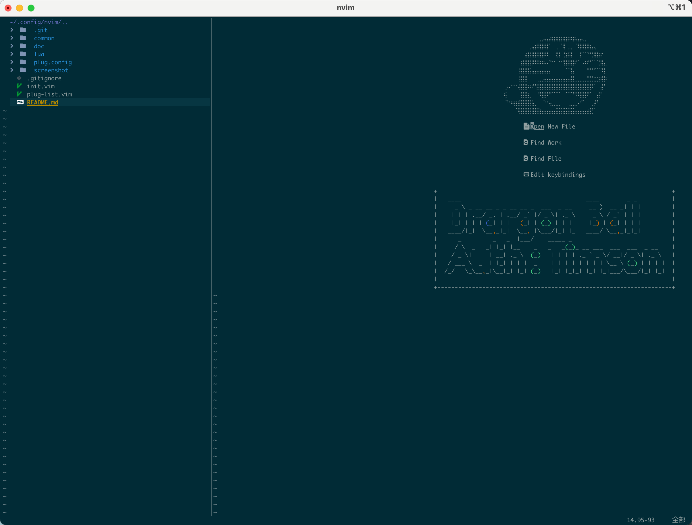
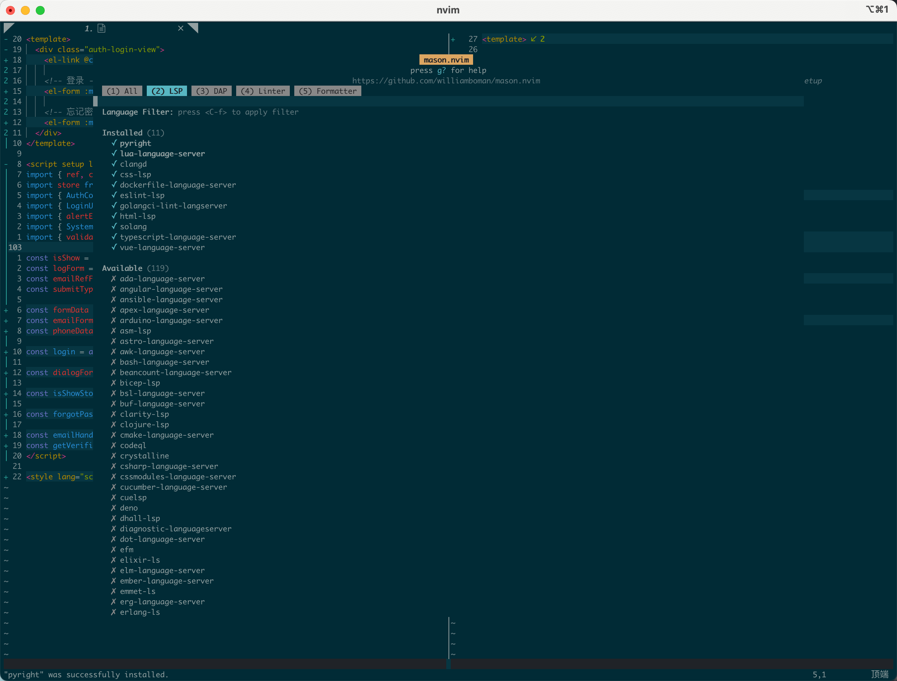
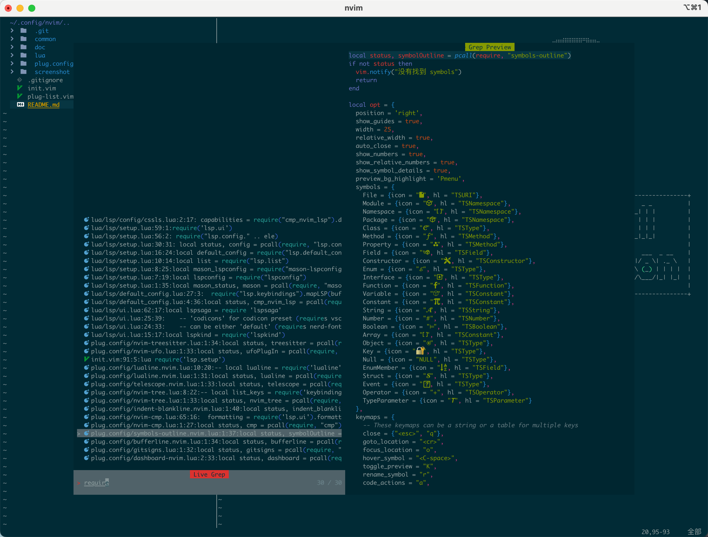
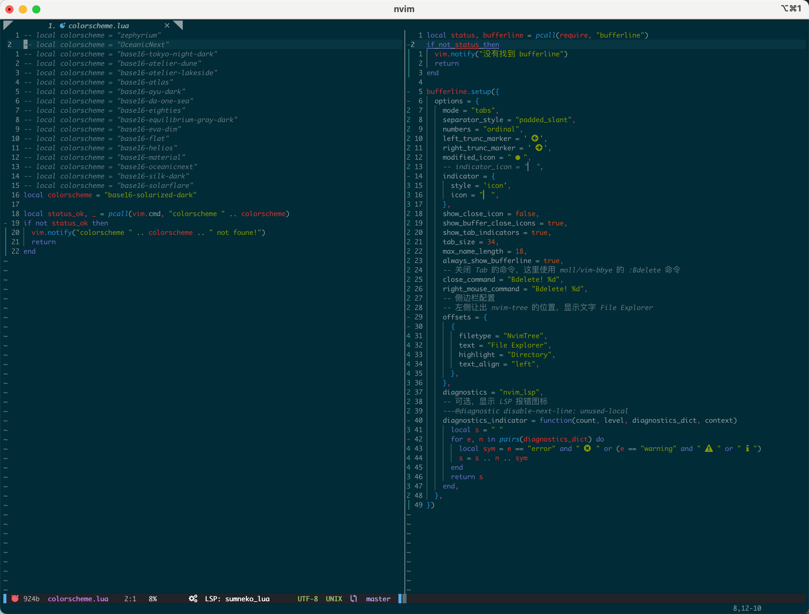
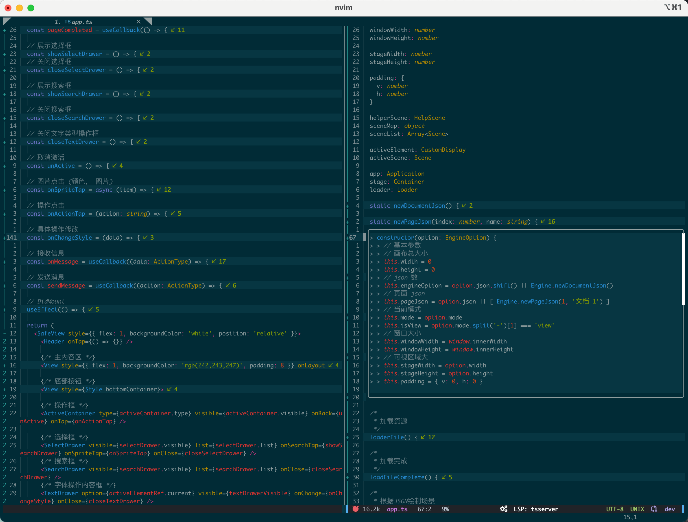

# 这个是我个人的nvim配置
> Mac OS, Linunx 适用

欢迎大神们指导，给小弟提提建议
持续完善

## ScreenShot
### 功能截图







### 语法高亮截图





## 安装
- [MacOS安装](./doc/start_mac.md)
- [Linunx安装](./doc/start_linunx.md)


## 使用

- 启动
```bash
$ nvim
```

## 结构说明

- init.vim(主要配置文件入口)
- plug-list(所需要的插件列表)

- common(修改自定义映射键位, 其他配置功能(无需插件的))
- colors(主题配色方案, 需要使用的时候 直接在init修改即可, 修改主题配色的插件，本人觉得没有什么必要，所以就不安装了，手动修改即可)
- plug.config(各个插件的配置文件,个人比较喜欢归类,所以每一个插件的配置文件都是单独一个vim文件的)
- lua(主要存放LSP配置，由lua编写)

## 功能说明
- [x] Start Page
- [x] LuaLine && bufferLine
- [x] File System
- [x] Git Gutter
- [x] Fold && Indent tips
- [x] Color render
- [x] Python virtualenv wrapper
- [x] find file in project
- [x] LSP(c, go, python, javascript, javasciptreact, vue)
- [x] TagBar Support(js, python, md, json)

